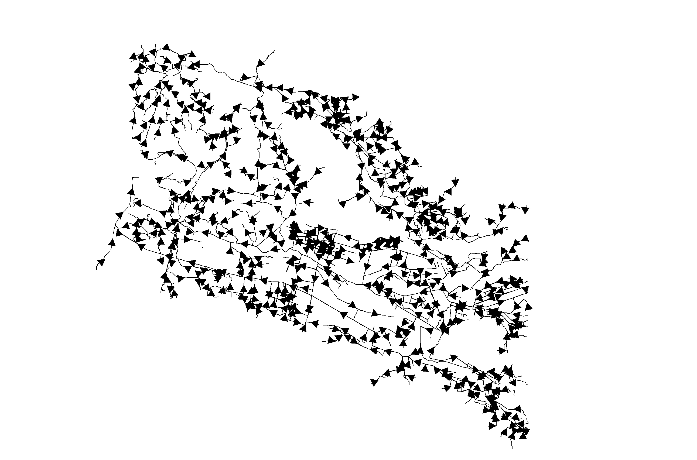
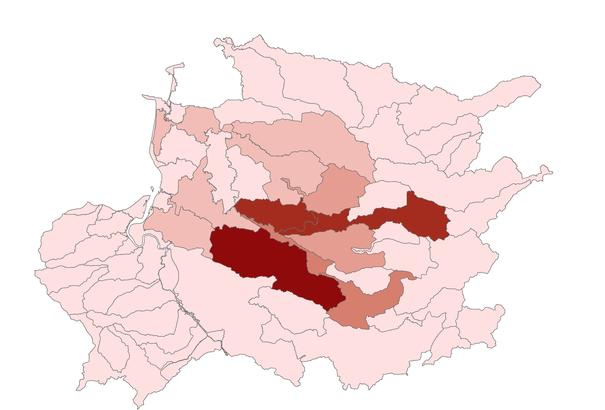

**Verion: 1.0**

**Date: **

**Authored by: Nathaniel Legall**

**Checked by: **

This document has been written as technical guidance for the eel habitat map produced as part of the Brue Valley Eel project.

# Acknowledgements 
We would like to thank the Somerset Internal Drainage Board for providing the base structure data to produce the map. We are also grateful to the Sustainable Eel Group got providing feedback on intitial drafts of the map. This work was funded by the European Maritime Fisheries Fund.


# Executive Summary 

*****

# Introduction 

[comment]: (this should not be included)

# Eels in the UK and Somerset

The European Eel (*Anguilla anguilla*) is a long, narrow fish with a complex lifecycle that encompasses living in both fresh and sea water. Thought to spawn in the Sargasso Sea, European Eels enter the Brue Valley via the Svern Estuary as glass eels. They then spend up to 20 years (possibly longer) in the valley's freshwater system before migrating back out to sea to return to their spawning grounds. The European Eel is currently classified as critically endangered.


European Eel numbers have declined in Somerset, in line with national trends, but they remain relatively common across the Levels. The local rivers still support strong commercial fisheries.The River Brue runs adjacent to the River Pattett which supports the second largest commercial glass eel fishery in the UK. This is thought to be primarily due to restricted access for eels into and within the catchment - due to flood and water level sluices acting as barriers. The Somerset Wildlife Trust nature reserves Catcott, Westhay Moor and Westhay Heath represent excellent potential habitat to improve eel productivity. However, access in and out is restricted due to blockages and sluices in, out and between the wetlands, and to the waterways to the Brue. 

Diadromous species like Atlantic salmon (*Salmo salar*), European eel (*Anguilla anguilla*) and migratory Brown trout (*Salmo trutta*, sea trout) are particularly sensitive to barriers, as juvenile and adult life stages must make extensive migrations across the freshwater environment (e.g., Thorstad et al., 2010). Barriers placed lower in a river network mostly affect diadromous fishes (Cote, 2009; Fullerton, 2010). Barriers are therefore a potentially important constraint on production and population persistence where access to and from spawning and rearing habitats is limited (Holbrook, Kinnison & Zydlewski 2011; Brown et al. 2013), prevented (Gephard & McMenemy 2004), or delayed (Venditti, Rondorf & Kraut 2000; Anon 2009; Nyqvist et al. 2017)


Otter (*Lutra lutra*) and mink (Mustela spp.) also take eel. Although there is no available information on the likely levels of eel predation by other species, [@Miranda2008] found that otter diet was dominated by eel in the Somerset Levels, (28% of the food biomass annually and 56% in Autumn). Despite this preference, populations of these mammals are much lower than those of fish-eating birds and they are likely to contribute a very small proportion of silver eel mortality [@Defra2010]. 

# Economic value of European Eel in South West/Somerset
There is evidence from the Domesday Book (Anon. 1086) of extensive eel fisheries in the Thames, which persisted up until the end of the 19th century [Defra2010]. Only hand-held dip nets are permitted for the capture of glass eels or elvers, and fishing is concentrated where the fish are plentiful and easy to catch – principally in estuaries of the Severn and other rivers draining into the Bristol Channel. The fishing season is short, coinciding with the elvers entering rivers on spring tides in April and May

Eels are caught commercially in a number of locations across England and Wales, although East Anglia is the main centre. Adult eel are caught by a variety of instruments including fyke nets, putcheons and weir traps. A small amount of eel trawling also takes place off the south coast of England and in the Thames Estuary. As with elvers, most adult eel catches are exported; however, the main market for adult eels is mainland Europe. Surprisingly, in the UK domestic market for jellying 90 per cent of the eels used come from farmed imports.

Fishing for eels in their various life stages can deliver significant economic benefits to local rural economies. In 1997, the export value of adult eels was estimated to peak at £2.5 million and, in 1998, that for the elver or glass eel fishery was estimated at £2.6 million. While small in comparison with the sums involved in the marine fish trade, eel fisheries make a useful contribution to the UK’s balance of payments. The export value of elver fisheries peaked at £2.6 million in 1998, but has since declined, with annual income per fisherman falling from £2000 to less than £900. As demand for elvers to stock eel farms has fallen, so prices have also fallen, settling nearer to those of the late 1980s and early 1990s. Adult eel exports now make only a very small contribution to the balance of trade. The total first-sale value of the adult eel fishery has declined from its peak of £2.5 million in the late 1990s to less than £0.5 million in 2000. Offset against this is the import of between £170,000 (in 2000) and £380,000 (in 1999) of imported fresh and frozen eels. The trend is one of falling demand for eels in England and Wales and in mainland Europe. This is compounded by a greater reliance on eel farming and cheaper imports from the Far East depressing local prices.

# Legal requirements to protect Eels in Somerset & UK
There is a legislative requirement to restore free passage, increase habitat  availability, and limit anthropogenic losses at intakes to aid eel recovery and good ecological status; necessitating an improved understanding of underlying processes [Piper2013a]. The Environment Agency has a duty to maintain freshwater and Eel fisheries, both of which play an important role in the wildlife interest of the Brue Valley area. The fisheries are a major part of the wildlife interest especially Eels which are widely distributed. Planned works to improve water level management will have to consider fisheries improvements and any new structures should allow for the free movement of Eels and Elvers [@NA:18]. The EU regulation 1100/2007 – article 2.4 states “The objective of each [EU] Eel Management Plan shall be to reduce anthropogenic mortalities so as to permit with high probability the escapement to the sea of at least 40 % of the silver eel biomass relative to the best estimate of escapement that would have existed if no anthropogenic influences had impacted the stock”. 

For more informatin on the current conservation assessment of European Eel please visit the [IUCN website](https://www.iucnredlist.org/species/60344/45833138)


# Threats to European Eel in the River Brue

It is important to recognise that a significant decline in eel recruitment is in some way connected with a long-term change in oceanic currents that can only be seen over decades. The parallel decline of the recruitment of the American eel in some of its distribution area and the correlation between the recruitment and the North Atlantic Oscillation both tend to support this view.

Large-scale reductions of wetlands have resulted in a major loss of eel habitat. Wetland loss - mainly caused by land reclamation for agricultural use continues but at a much faster rate than before. The Natural WET index - an indicator of change in area of all natural wetlands shows a 30 per cent decline over the past 40 years. More recent estimates from the IPBES show a 87 per cent loss of wetland habitat globally in the last 300 years, and 54 per cent since 1900 [IPBES2019]. The reduction of wetland area directly affects European Eel populations since they will face reduced habitat availability and increased competition for food and other resources. All across Europe, dams, weirs and dikes have been constructed in recent years (most of the large dams have been built since the Second World War). These kinds of barriers make it much more difficult (and in some cases quite impossible) for eels to migrate up rivers; then, because their survival in the lower reaches of rivers is density dependent, the number of adult eels returning to sea is greatly reduced. Hydropower stations can kill very many of the downstream migrating silver eels, and the available information indicates a serious impact on the spawner population. The turbine blades can kill anything from 10 per cent to 100 per cent for a single passage, and the problem is inevitably compounded when there are several turbines in series. It is estimated that between 2,500 and 10,000 tonnes of eels are killed each year in turbines – the latter figure being equal to the total declared commercial catch.

Another concern is that the accumulation of pollutants – in particular heavy metals and pesticides – may impair the reproductive capability of the eel. The emission of PCBs into the environment preceded the recent decline of the European stock; and that PCBs and DDTs had a negative impact on the lipid levels in eels. The review concluded that contamination with PCBs and other pollutants may have contributed to the decline of eel recruitment observed since 1980 [Defra2010].

There is ample evidence that some fisheries can take so many eels that they significantly reduce the number of potential spawners getting back to sea. The available information also suggests that in extreme cases no potential spawners may be reaching the sea.

Cormorants have been identified as the major eel predator. The food intake of a cormorant is approximately 400 to 500 grams per day, and the present estimate of the European breeding population is 250,000 to 300,000 pairs. Cormorants have been estimated to consume between 1800 tonnes of eels per year (two per cent of their yearly diet) and 9000 tonnes of eels per year (20 per cent of their yearly diet). 

The parasite *Anguillicola crassus*, introduced from the Far East, and other pathogens can have an impact on eel populations. Anguillicola crassus spread rapidly in theEuropean eel population in the early 1980s. This parasite causes swim-bladder dysfunction and can impair the migration of mature eels.The decline of the eel in Europe is often related to a reduction in the amount, quality and accessibility of its continental habitat. One way through which habitat has been made more accessible to European Eel aross the Brue and Parrett catchments has been through the instllation of fish passes by the Environment Agency to a number of medium sized (3 - 5 metres long) structures. The importance of these aforementioned factors compared with the impact of exploitation has not been quantified, but it seems likely that they are significant in many European countries.

The River Brue catchment is geographicaly adjacent to the River Parrett which supports the second largest commercial glass eel fishery in the UK. The Brue is similar in size to the Parrett catchment, yet it's eel populations and productivity are believed to be much lower than the Parrett. This is thought to be primarily due to restricted access for eels into and within the catchment  - due to flood and water level sluices acting as barriers. Barriers represent one of the largest anthropogenic impacts on the ecological status of rivers [Gido2015], and they also potentially restrict fishes' ability to respond to future environmental changes [Cote2009]. Thus, river management aims to restore the longitudinal connectivity of rivers to allow continuous migration and movement of water, sediments and biotype [Radinger2018]. However, it is often unclear whether the targeted barriers are also those most relevant for fish species, particularly to track future habitat shifts caused by environmental change The Somerset WIldlife Trust reserves at Catcott and Westhay have excellent potential as eel habitat to improve eel productivity. However, access in and out is restriced due to the aforementioned blockages, out and between the wetlands, and to the waterways to the Brue. 

This project will identify what future work can be undertaken to maximise the eel productivity of the Brue Catchment.

## Key aims of project work

The stated aims for this element of the funded project are as follows;
- To identify barriers to escapement and passageway through the lower Brue catchment to the Severn Estuary 
- To map a wetland ecological network that takes account of habitat and permeability for eels *this can be moved to the network write-up*

# Methodology

#Study Area

The Brue Valley is part of the Somerset Levels and Moors (a low-lying region of north and central Somerset bisected by limestone ridges and hills) and covers almost 12,500 hectares of the floodplain of the River Brue between Glastonbury in the East and the M5 in the West. The Somerset Levels and Moors is a landscape of highly artificial rivers and intense human management of water and it is this intense management that determines habitat type and land use in the Brue Valley. Habitats present in the Brue Valley include;
- Coastal and Floodplain Grazing Marsh
- Lowland Meadow
- Purple moor grass
- Rush pasture
- Fen
- Reedbed
- Wet Woodland
The Brue Valley is bisected by the North Drain, River Brue, South Drain and Huntspill River. [Gold Corner pumping station](http://ea-lit.freshwaterlife.org/archive/ealit:950) is at the junction of the South Drain, Cripps River and the Huntspill River. The station is used to prevent flooding in the Brue Valley, maintaining acceptable water levels in the South Drain and to keep the Huntspill River - which acts as a local reservoir - topped up during the Summer. Water is lifted some 3 metres (8.5 feet) from the South Drain to the Huntspill River.

The Somerset Wildlife Trust's Catcott and Westhay nature reserves exist in the centre of the Brue Valley. Catcott Nature Reserve (Centre grid reference = ST404411) comprises a series of low-lying fields, carr and former peat workings with numerous ditches that forms part of the extensive grazing marsh and high level wet ditch system.  Near the centre is the original reserve known as Catcott Heath, a mosaic of widely differing habitats – most importantly NVC S24 fen vegetation, with milk parsley (*Puecedanum palustre*) and bog myrtle (*Myrica gale*), mixed broadleaf woodland, peat ponds and ditches. To the west is a partially worked peat digging, known as Great Fen  comprising reed fen where the peat has been removed and restored fen where sufficient peat remains. 1,000,000 glass eels were introduced to this compartment during 2015. Separate and to the south lies a small restored former peat working, known as Catcott Fen, with a wet reed bed community. Westhay Moor National Nature Reserve and Westhay Moor Nature Reserve comprise areas of wetland mosaics including tall fen vegetation, marshy grassland, willow scrub, alder carr, small ponds, open water channels and the remnants of acid raised mire form previously used for peat extraction in the heart of the peat moors on the Somerset Levels. Catcott and Westhay Nature Reserves represent areas of optimal habitat for European Eel of different life stages (West, 2019) so were used as the targets during GIS analysis. 

A bounding box was set encompassing the majority of the legacy Brue Valley Living Landscape project area.


#Data preparation

The 'Open Rivers' layer on the Somerset Wildlife Trust S drive was used to form the majority of the underlying river network. The line layer shows most of the EA 'main rivers' and streams throughout Somerset including the River Brue, Huntspill, North Drain and South Drain. 
- see S:\GIS\Layer Library\Environmental or contact the Somerset Environmental Records Centre
This was merged with the IDB viewed rhynes line layer using the 'Merge' tool to include detail of smaller arterial waterways, ditchers and 'rhynes' (local term for dicthes). The [FIPEX quality control tool](http://www.rivex.co.uk/Online-Manual/Qualitycontrolyourrivernetwork.html) was used to identify topology issues with the river network. The following network aspects were checked;
- Polyline attributes
- Zero (null) length polylines
- Multi-part polylines
- Self-intersecting polylines
- Disconnected polylines
- Intersecting polylines
- Find cycles
The resulting error log file 'intersections.txt' was used to identify and rectify false intersections within the river network. The 'Topology' tool within ArcMap was used to highlight and fix gaps within the river network. 
- see toolboxes\system toolboxes\data management tools.tbx\topology\add rule to topology


'Must not have gaps' and 'Must not overlap' were set as the topology rules. 1209 topology errors were identified - each error was highlighted as a red square in a new layer. Topology errors were manually resolved using the 'Error Inspector' and 'Topology' toolbar with reference to satellite imagery. 


In GIS, nodes represent the beginning and end of an edge. The nodes are an important component of a network representing a river system because they denote the locations where rivers, streams and ditches connect to each other. The 'From node' and 'To node' were only present for the IDB viewed rhynes data ('STARTNODE' and 'ENDNODE'). New nodes were created using RivEX following the 'Building nodes for the first time' [protocol](http://www.rivex.co.uk/Online-Manual/Buildingnodesforthefirsttime.html). The following [attributes](http://www.rivex.co.uk/Online-Manual/Attributerivernetwork.html) were added to the river network;
- Strahler order
- Distance to mouth
- Upstream Accumulated Length
- Catchment ID
In order to represent the movement of European Eels leaving the Brue Valley river system towards the coast, the [Re-orientate a network to flow to mouth protocol](http://www.rivex.co.uk/Online-Manual/Reorientateanetworktoflowtomouth.html) was followed using RivEX. By adding arrows to the polylines users can visualise a theoretical 'flow' of mature eels migrating to the sea (layer = AxeBrueIDB_viewedrhynes_singlepart_topo). A duplicate layer was produced showing a flipped direction of migration into the Brue System using the 'Flip line' function in ArcToolbox (layer = AxeBrueIDB_viewedrhynes_singlepart_flipped). 
- toolboxes\system toolboxes\editing tools.tbx\flip line



```{r echo=FALSE, warning=TRUE, results= 'asis'}
points <- read.csv(file = "AxeBrueIDB_viewedrhynes_singlepart_topo.csv", header = TRUE)
library(knitr)
library(kableExtra)
kable(head(points[1:5,]), caption = "The first five rows of 'AxeBrueIDB_viewedrhynes_singlepart_topo.csv' attribute table for polyline layer of river system representing migration towards the coast", row.names = TRUE) %>%
   kable_styling(bootstrap_options = c("striped", "hover", "condensed"))

```
Known water control structures as managed by the Environment Agency and Somerset Internal Drainage Board were plotted as a point layer in ArcMap. The base layer used during geographic information system analysis is a merge of ['AxeBrueIDB_structures'](https://www.arcgis.com/apps/View/index.html?appid=22497f115856472eb9e58fdba3023191) and structures from the Somerset Internal Drainage Board water level [management plans](http://somersetdrainageboards.gov.uk/environment/wlmps/) (WLMPs) for the North Drain and South Drain. Structure management information showing when structures were open or closed was only available for 24% of the final dataset (N = 103). 

```{r echo = FALSE, results = 'asis'}
sources <- read.csv(file = "WaterStructureAnalysisFiles.csv", header = TRUE)
library(knitr)
kable(sources, caption = "Water Control structure data and sources", row.names = TRUE, format = 'html')

```

The locations of water control structures from all three sources were viewed as point layers in ESRI ArcMap (v. 10.6) before being merged using the 'Merge' tool in ArcToolbox. The field map was left unchanged. 
- toolboxes\system toolboxes\data management tools.tbx\general\merge


```{r echo = FALSE, results = 'asis'}
Snapped <- read.csv(file = "AxeBrue_IDB_merged_140219_Snapped.csv", header = TRUE)
library(knitr)
kable(head(Snapped[1:5,]), caption = "The first five rows of 'AxeBrue_IDB_merged_140219_Snapped.csv' table which shows all structures included in the analysis", row.names = TRUE)

```

The RivEX [snapping sites to network tool](http://www.rivex.co.uk/Online-Manual/Snapsitestonetwork.html) was used to ensure that the point layer overlapped the polyline layer. A snapping tolerance of 20m was used. 

#RivEX analysis

Barrier analysis was carried out using a river network tool RivEX (v 10.28) with ESRI ArcMap (v. 10.6). Following the ['Distances between dams worked example'](http://www.rivex.co.uk/Online-Manual/Distancesbetweendamsaworkedexamp.html) the amount of  habitat available for each water control structure was calculated and added as a seperate column to the point layer's attribute table. This was then visualised in ArcMap by changing the layer symbology using a colour gradient with 10 natural breaks to allow users to prioritise structures by showing the amount of potential habitat that would be opened up if a fish pass was added.


```{r echo = FALSE, results = 'asis'}
Downstream <- read.csv(file = "AxeBrue_IDB_DS_160219.csv", header = TRUE)
library(knitr)
kable(head(Downstream[1:5,]), caption = "The first five rows of 'AxeBrue_IDB_DS_160219' attribute table  showing the additional column for 'AvailDSnet showing the amount of available habitat in a 'downstream' or Westerly direction", row.names = TRUE)

```
A draft version of the map was sent out to project partners and potential users for feedback including the Environment Agency, Sustainable Eel Group, Westcountry Rivers Trust and Somerset Wildlife Trust. 


# Results
The final layers used during analysis included 433 water control structures within the study area. Penstocks were the most frequent structure type included in the barrier analysis (N=103). Outlets and spillways were the least frequent structure type in the study area (N=1). 48 structures did not any of the major structure types from their descriptions.

```{r echo = FALSE, results = 'asis'}
Bar <- read.csv(file = "AxeBrue_IDB_merged_140219_Snapped.csv", header = TRUE)
library(ggplot2)
g <- ggplot(Bar, aes(structure_)) +
  geom_bar(fill = "#0073C2FF") +
  ggtitle("Water control structure frequency in the Brue Valley by type") +
  theme_classic()
g + theme(
axis.text.x = element_text(angle=90, hjust=1),
axis.title.x = element_blank(), 
axis.title.y = element_blank())


```
```{r echo = FALSE, results = 'asis'}
library(dplyr)
df <- Bar %>%
  group_by(structure_) %>%
  summarise(counts = n())
df


```

Most structures included in the analysis can be found in the South Drain catchment (N=25). Structure density is lowest on the River Yeo and Shipham Rhyne.



```{r echo = FALSE, results = 'asis'}
Top10DS <- read.csv(file = "AxeBrue_IDB_DS_160219_Ordered.csv", header = TRUE)
library(knitr)
kable(head(Top10DS[1:10,]), caption = "The top 10 structures highlighted by the habitat map with the greatest available habitat in a 'downstream' or Westerly direction", row.names = TRUE)
```

```{r echo = FALSE, results = 'asis'}
Top10US <- read.csv(file = "AxeBrue_IDB_US_170219_Ordered.csv", header = TRUE)
library(knitr)
kable(head(Top10US[1:10,]), caption = "The top 10 structures highlighted by the habitat map with the greatest available habitat in a 'upstream' or Easterly direction", row.names = TRUE)
```

When plotted as a histogram, the amount of potential habitat that could be realised upstream or downstream in the Brue Valley was heavily skewed to the left. Several outliers exist for both habitat maps which are represented by the top 10 tables.

```{r echo = FALSE, results = 'asis'}
library(ggplot2)
ggplot(Top10DS, aes(x=AvailDSNet)) + geom_histogram(binwidth = 1000) +
    scale_y_continuous(limits=c(0,125)) +  
 geom_vline(aes(xintercept=mean(AvailDSNet, na.rm=T)), 
               color="blue", linetype="dashed", size=1) +
  xlab("AvailDSNet(m)")
```

```{r echo = FALSE, results = 'asis'}

ggplot(Top10US, aes(x=AvailUSNet)) + geom_histogram(binwidth = 1000) +
    scale_y_continuous(limits=c(0,250)) +  
 geom_vline(aes(xintercept=mean(AvailUSNet, na.rm=T)), 
               color="yellow", linetype="dashed", size=1) +
  xlab("AvailUSNet(m)")
```

The resulting habitat maps can be viewed on [ArcGIS online](http://arcg.is/8qavW). Darker points show structures that have the potential for releasing the most habitat downstream or upstream if modified for fish passability. These layers do not account for the quality of 'available habitat' upstream/downstream. 'Habitat availability' is based on the assumption that all underlying habitat is suitable for European Eel. In the absence of detailed biological information or appropriate models of habitat quality this is a common approach (see Buddendorf, 2017; Cote, 2009; Grill, 2014; Sheer, 2006). The layers also do not include information on the management of individual structures. For example, a structure closed during Winter Penn is likely to restrict access to all habitat downstream for eels moving through the system. Somerset Wildlife Trust would like to include information on the potential financial cost of improving structure permeability in future iterations of the eel passability scores. 

# Discussion

River regulation, in the form of damns or levees, restricts both the lateral connectivity between the river and the floodplain and the temporal and spatial variance in connectivity in the main stem of the river (Ward & Stanford, 1995; Kingsford, 2000). A number of GIS tools and software packages exist for assessing the impact of water control structures on river system connectivity. 

# NATIONAL INVENTORY AND ASSESSMENT PROCEDURE—For Identifying Barriers to Aquatic Organism Passage at Road-Stream Crossings
#The Vermont Culvert Aquatic Organism Passage Screening Tool

[Kirn2009] The Vermont Culvert Aquatic Organism Passage Screening Tool consists of three components; the coarse screen, the retrofit potential screen and habitat connectivity potential screen. The aquatic organism passage coarse screen characterizes the expected level of aquatic organism passage based on a set of physical measures of the culvert and adjacent stream during low flow conditions. This first level of screen is useful at the watershed and subwatershed scales to observe regional conditions and to begin to identify structures having the most impact on species of interest. The aquatic organism passage retrofit potential screen identifies the likelihood of improving passage via structural changes at a culvert. The aquatic organism passage habitat connectivity potential screen indicates the amount of habitat that would be re-connected if passage were to be improved at a structure (for example, through installation of a fish pass). This screen is best applied at the subwatershed and local catchment scales to realize the potential gains in habitat due to changes at a specific structure or set of structures.

# SNIFFER

[The WFD111 (2a) Coarse resolution rapid-assessment methodology to assess obstacles to fish migration](https://www.sniffer.org.uk/wfd111-phase-2a-fish-obstacles-manual-pdf) (commonly known as the SNIFFER method) was been developed to help prioritise the removal or mitigation of man-made in-river structures that impede the migration of fish populations. It has been designed to provide a procedure for rapidly assessing at a coarse level the likely passability of obstacles. The methodology is based on published data describing the swimming and leaping abilities of different fish species. The method was tested against real fish population data. 


SNIFFER has been used for minor assessments of natural obstructions across Devon by the [Westcountry Rivers Trust](http://wrt.org.uk/sniffing-out-weirs/) to moderate success (pers comms. S. West). 

[WHo else has used SNIFFER?]
[SNIFFER, 2011][Bull]

[Why didn't you use it?]
#FishXing

FishXing is a software designed to assist engineers, hydrologists and fish biologists in the evaluation and design of culverts for fish passage [FishXing2006] .The software requires the following inputs;
- Culvert Shape 
- Dimensions (diameter, rise, span) 
- Material and Corrugation 
- Installation (At Grade or Embedded) 
- Culvert Length 
- Culvert Slope (Can be automaticlally calculated if inlet and outlet bottom elevations are known) 
- Culvert Outlet Bottom Elevation 
- Entrance Loss (a constant used to determine the amount of energy loss as the water enters the culvert inlet.)
The software is only designed for culverts which are frequenly installed in the United States under highways are roads that bisect waterways. FishXing is still available from the [United States Forest Service](https://www.fs.fed.us/biology/nsaec/fishxing/) as a Windows .exe build and provides investigators an accurate indicator of a culvert's permeability to fish. This could be useful tool for future work investigating movement within SWT reserves. 
Once permeability scores have been gathered for water control structures across the riverscape, connectivity models can be used with GIS to develop prioritisation excercises. 

# Barrier Analysis Tool

The Barrier Analysis Tool (BAT) produced by the [University of Southampton](https://www.geodata.soton.ac.uk/geodata/gis/project173) is a tool aiding managers in quantifying the amount of river made available to fish through the removal of barriers would provide valuable information in understanding the impact of barrier removal and in evaluating the prioritisation of restoration actions. The tool is available BAT is designed for the analysis of completely natural systems and is unable to handle 'loops' within the river network. Loops are circular paths created when two polylines share the same to and from nodes (see methodology for explanation of nodes). The Brue system includes several heavily managed rivers which are important to ecological flow not to mention the hundreds of dicthes that all create loops within the river network line layer. Use of BAT was quickly discounted on this basis. 
 
#FIPEX

Where detailed and up-to-date structure data other investigators have produced barrier permeability models for other fish species over large scales. 
The Scottish barrier prioritisation model was developed using the Fish Passage Extension (FIPEX) for ArcGIS. FIPEX is able to produce a single comporable metric of a structure's impact on fish passability known as the Dendretic Connectivity Index (or DCI) which makes it useful for providing the information necessary for local and national prioritisation of management resources. 

Barrier prioritisation should be sensitive to habitat weighting since not accounting for habitat quality can lead to over- or underestimating the importance of impassable manmade barriers [@Buddendorf2018]. [@Buddendorf2018] developed a flexible scalable approach for assessing the effects of manmade barriers on longitudinal connectivity for Atlantic salmon across Scotland, that considered the production potential of different habitats, the potential effects of passable manmade barriers under a range of passability values. The current iteration of the map can be viewed [here](http://marine.gov.scot/information/barriers-and-obstructions-freshwater-rivers)


The 'passability' of barriers was informed by the [Scottish Obstacles to Fish Migration data set](https://www.sepa.org.uk/environment/environmental-data/). These data were initially collated in the 1980s by staff from Marine Scotland Science using information provided by District Salmon Fishery Boards, Fisheries Trusts and local angling clubs. Additions were made to the map since the 80s and a major update to the fish barrier dataset was produced in 2008 which is now managaed by the Scottish Environment Protection Agency. [Buddendorf2018] developed their own metric for barrier passability known as DCI~SCOT~ which better accounted for the amount of habitat available upstream as part of the barrier prioritisation process [@Buddendorf2018].

Attempts were made to apply FIPEX to the Brue Valley Eel system however the plug-in is no longer supported and doesn't function with ArcMap 10.6 [what year did this end? what version of ArcMap DOES it work with?]. In order to make use of the underlying R code we also contacted the authors of the Scottish barrier map. We were unable to obtain the underlying R code for calculating DCI through data mining the original plug-in or contacting FIPEX's authors [refer to FIPEX manual- why doesn't the FIPEX manual come up in the mendeley search?]

[Mahlum2014a] demonstrated that the DCI produced by FIPEX shows biological relevance with regards to understanding fish communities and individual species distribution and abundance, even in the presence of confounding variables such as elevation, stream width, and land cover.

For a more detailed review of connectivity modelling studies for riverine systems please see  [Fullerton2010].

#Structure assessment surveys

A major issue identified by this map is the lack of individual 'permeability' or 'passability' scores for each barrier. You need to explain why these haven't been included yet in detail, provide explanations for why you haven't used other tools and what your solution is (ZSL eel assessment). Two or three examples of Species specific connectivity software + studies to look at effect of barriers would be good as well. 

Individual passability scores for each barrier have not been included due to a lack of data. Local stakeholders do not hold information on the following aspects of water control structures needed for barrier assessments;
- Management, Management of structures has the greatest effect on fish permeability. Piper (2013) found that management regimes of sluice gate position, abstraction rate and weir spill strongly affected probability of entrainment at intakes and the route choice of eels. Management information was only available for a subset of the full structure dataset. 
- Material
- Aspect/Gradient
These features cannot be infered from satellite imagery and require surveys on the ground. There are several protocols available for assessing the permeability of water control structures to fish. 


# Recommendations


- Tables with top 3 passes for upstream, downstreamm and both directional movement
- Future work to develop map further - add financial implications to decision making
- Collect data from Environment Agency and IDB groundsmen on individual structure management

# References