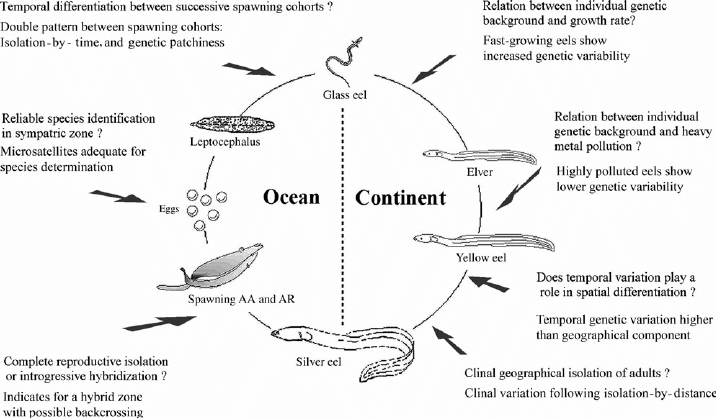

This document has been written as technical guidance for the eel habitat map produced as part of the Brue Valley Eel project.

# Introduction 

## Eels in the UK and Somerset

The European Eel (*Anguilla anguilla*) is a long, narrow fish with a complex lifecycle that encompasses living in both fresh and sea water. Thought to spawn in the Sargasso Sea, European Eels enter the Brue Valley via the Svern Estuary as glass eels. They then spend up to 20 years (possibly longer) in the valley's freshwater system before migrating back out to sea to return to their spawning grounds. The European Eel is currently classified as critically endangered.

European Eel numbers have declined in Somerset, in line with national trends, but they remain relatively common across the Levels. The local rivers still support strong commercial fisheries.The River Brue runs adjacent to the River Pattett which supports the second largest commercial glass eel fishery in the UK. This is thought to be primarily due to restricted access for eels into and within the catchment - due to flood and water level sluices acting as barriers. The Somerset Wildlife Trust nature reserves Catcott, Westhay Moor and Westhay Heath represent excellent potential habitat to improve eel productivity. However, access in and out is restricted due to blockages and sluices in, out and between the wetlands, and to the waterways to the Brue. 

Otter (*Lutra lutra*), and mink (Mustela spp.) also take eel. Although there is no available information on the likely levels of predation, [@Miranda2008] found that otter diet was dominated by eel in the Somerset Levels, (28% of the food biomass annually and 56% in the autumn). Despite this preference, populations of these mammals are much lower than those of fish-eating birds and they are likely to contribute a very small proportion of eel mortality [@Defra2010]. 

[Cultural value of European Eel in South West/Somerset?]

[Economic value of European Eel in South West/Somerset?]

[Legal requirements to protect Eels in Somerset & UK] The Environment Agency has a duty to maintain freshwater and Eel fisheries, both of which play an important role in the wildlife interest of the Brue Valley area. The fisheries are a major part of the wildlife interest especially Eels which are widely distributed. Planned works to improve water level management will have to consider fisheries improvements and any new structures should allow for the free movement of Eels and Elvers [@NA:18]. The EU regulation 1100/2007 – article 2.4 states “The objective of each [EU] Eel Management Plan shall be to reduce anthropogenic mortalities so as to permit with high probability the escapement to the sea of at least 40 % of the silver eel biomass relative to the best estimate of escapement that would have existed if no anthropogenic influences had impacted the stock”. [% of recruitment in UK eel management plans]

# Previous species specific connectivity Work in Somerset/South West England
[Has anyone done this or similar work before?]
Andy Don added passes prior to 2014 across Brue Valley. Appear to have been installed randomly as part of [what funding stream?]

[What is SNIFFER] [How was it developed?] SNIFFER has been used for minor assessments of natural obstructions across Devon by the Westcountry Rivers Trust to moderate success (pers comms. S. West).

[@Englandb]

# Studying habitat connectivity in riverine landscapes

# Species specific connectivity software + studies 

Rivex
FishXing

[Rationale for project work]

This project will identify what future work can be undertaken to maximise the eel productivity of the Brue Catchment.

## Key aims of project work

The stated aims for this element of the funded project are as follows;
- To identify barriers to escapement and passageway through the lower Brue catchment to the Severn Estuary 
- To map a wetland ecological network that takes account of habitat and permeability for eels

# Methodology

## Study Area

A bounding box was set encompassing the legacy area of the Brue Valley Living Landscape project area with an Eastern extent ... Southern extent..

# Results

# Discussion

# Recommendations

- Tables with top 3 passes for upstream, downstreamm and both directional movement
- Future work to develop map further - add financial implications to decision making

# References